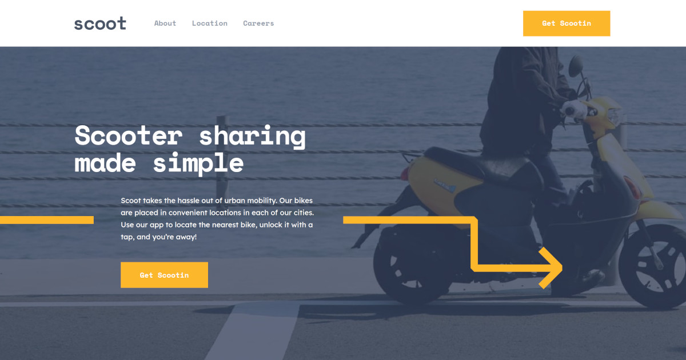

# Frontend Mentor - Scoot website solution

This is a solution to the [Scoot website challenge on Frontend Mentor](https://www.frontendmentor.io/challenges/scoot-multipage-website-N76alNPRJ). Frontend Mentor challenges help you improve your coding skills by building realistic projects. 

## Table of contents

- [Overview](#overview)
  - [The challenge](#the-challenge)
  - [Screenshot](#screenshot)
  - [Links](#links)
- [My process](#my-process)
  - [Built with](#built-with)

## Overview

### The challenge

Users should be able to:

- View the optimal layout for each page depending on their device's screen size
- See hover states for all interactive elements throughout the site

### Screenshot

### Links

- Solution URL: [https://www.frontendmentor.io/solutions/scoot-using-tailwind-and-vite-THbNmd1JsV](https://www.frontendmentor.io/solutions/scoot-using-tailwind-and-vite-THbNmd1JsV)
- Live Site URL: [https://scoot-multi-page-website-green.vercel.app/](https://scoot-multi-page-website-green.vercel.app/)

## My process

### Built with

- [React](https://reactjs.org/) - JS library
- [Tailwind](https://tailwindcss.com/) - CSS framework
- [Vite](https://vite.dev/) - Build toold

